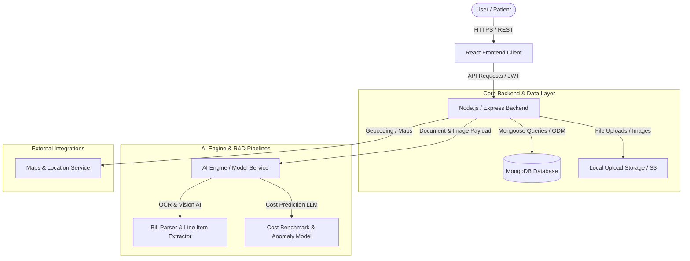
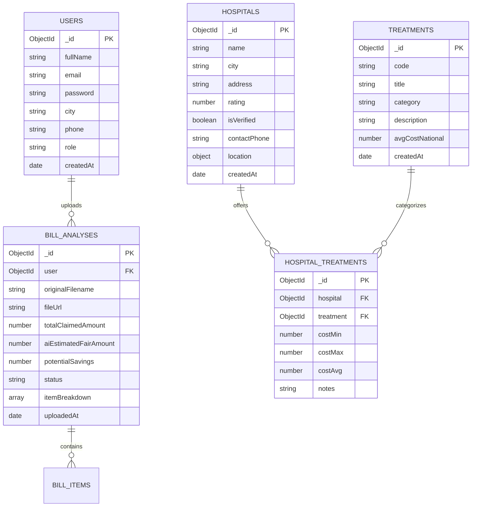

# System Architecture & Technical Specifications — Sasti-Sehat

This document outlines the system architecture, component breakdown, data flow, and database schema for **Sasti-Sehat**, an AI-powered healthcare price transparency platform using Node.js, Express, and MongoDB.

---

## 1. High-Level System Architecture

---

## 2. Technology Stack Breakdown

| Tier | Technology | Purpose | Responsible Lead |
| :--- | :--- | :--- | :--- |
| **Frontend** | React.js (Vite / CRA), Tailwind CSS / Vanilla CSS | Client-side web interface, interactive UI, state management | **NIKHIL Mengade** |
| **UI/UX Design & Backend** | Figma, Node.js, Express.js | UI Wireframes, design system, RESTful API server & auth | **SHREYASH LAGHANE** |
| **Database** | MongoDB, Mongoose ODM | Document store for hospitals, treatments, users, and bill logs | **SHREYASH LAGHANE** |
| **AI Engine** | Python / Node AI SDK, Tesseract OCR / Vision Models | Medical bill scanning, pricing anomaly detection, LLM analysis | **HARSH KATE** |
| **R & D** | Data Scraping, Healthcare Price Benchmarking | Data collection, pricing algorithm validation, market research | **OM VITEKAR** |

---

## 3. Component Details & Responsibilities

### 3.1 Frontend Architecture (React.js)
*Lead: NIKHIL Mengade | Design: SHREYASH LAGHANE*

- **Modular Component Hierarchy**:
  - `components/common/`: Reusable UI elements (Buttons, Cards, Modals, Loading Skeletons).
  - `components/bill-analyzer/`: Drag-and-drop file uploader, interactive bill breakdown, anomaly badges.
  - `components/search/`: Hospital & procedure search bar with auto-complete and filters.
  - `components/comparator/`: Side-by-side hospital cost comparison tables and interactive charts.
- **State Management & Data Fetching**:
  - Global State: React Context API or Redux Toolkit for auth user session and active bill state.
  - Server State: TanStack Query (React Query) or Axios for efficient API caching and error handling.
- **Routing**: React Router v6 for client-side navigation (`/`, `/search`, `/compare`, `/analyze-bill`, `/dashboard`).

---

### 3.2 Backend Architecture (Node.js / Express.js)
*Lead: SHREYASH LAGHANE*

- **API Layer**: Express Router handling REST API routes versioned under `/api/v1/`.
- **Key Modules**:
  - `auth/`: User registration, login, JWT token generation, role-based access control.
  - `treatments/`: Search procedures, fetch average cost benchmarks by region.
  - `hospitals/`: Query hospital profiles, listed services, transparent cost breakdowns, and ratings.
  - `bills/`: Handle multipart bill image/PDF uploads, queue processing, store results.
  - `ai/`: Proxy requests to the AI engine for OCR extraction and cost analysis.

---

### 3.3 Database Schema (MongoDB Collections & Mongoose Schemas)

---

## 4. API Endpoints Overview

| Method | Endpoint | Description |
| :--- | :--- | :--- |
| `POST` | `/api/v1/auth/register` | Register a new user |
| `POST` | `/api/v1/auth/login` | User login & JWT issuance |
| `GET` | `/api/v1/auth/me` | Fetch authenticated user profile |
| `GET` | `/api/v1/treatments` | Search procedures & pricing benchmarks |
| `GET` | `/api/v1/treatments/:id` | Get treatment details & national benchmark |
| `GET` | `/api/v1/hospitals` | List hospitals with filters (city, rating, query) |
| `GET` | `/api/v1/hospitals/:id` | Get single hospital details |
| `GET` | `/api/v1/hospitals/:id/costs` | Get itemized treatment costs for a hospital |
| `POST` | `/api/v1/bills/upload` | Upload medical bill (image/PDF) for AI analysis |
| `GET` | `/api/v1/bills` | Get user's analyzed bills |
| `GET` | `/api/v1/bills/:id` | Retrieve AI analysis report for a bill |
| `POST` | `/api/v1/ai/estimate-cost` | Estimate out-of-pocket procedure cost with insurance |

---

## 5. Security & Performance Considerations

1. **JWT & RBAC**: Secure authentication for patients and platform admins.
2. **MongoDB Indexing**: Geospatial and compound text indexes on Hospital (`city`, `name`) and Treatment (`title`, `category`, `code`) collections.
3. **Rate Limiting**: Express rate limiting on API endpoints to prevent abuse.
4. **CORS & Helmet**: Security headers enabled via `helmet` and strict CORS policies.
